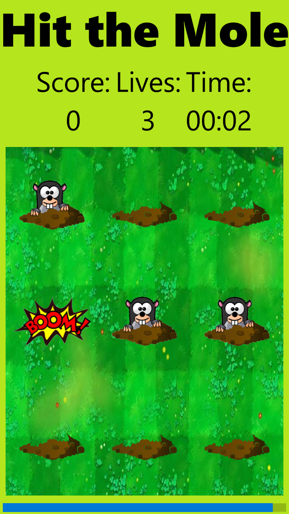
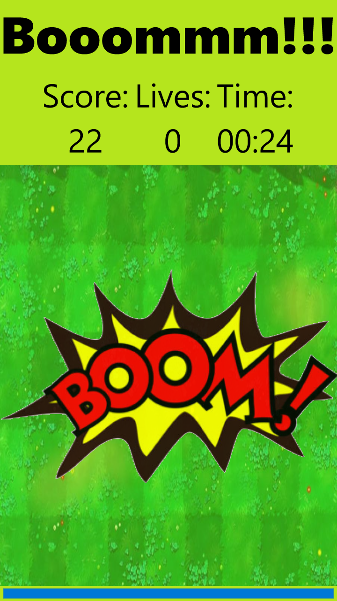
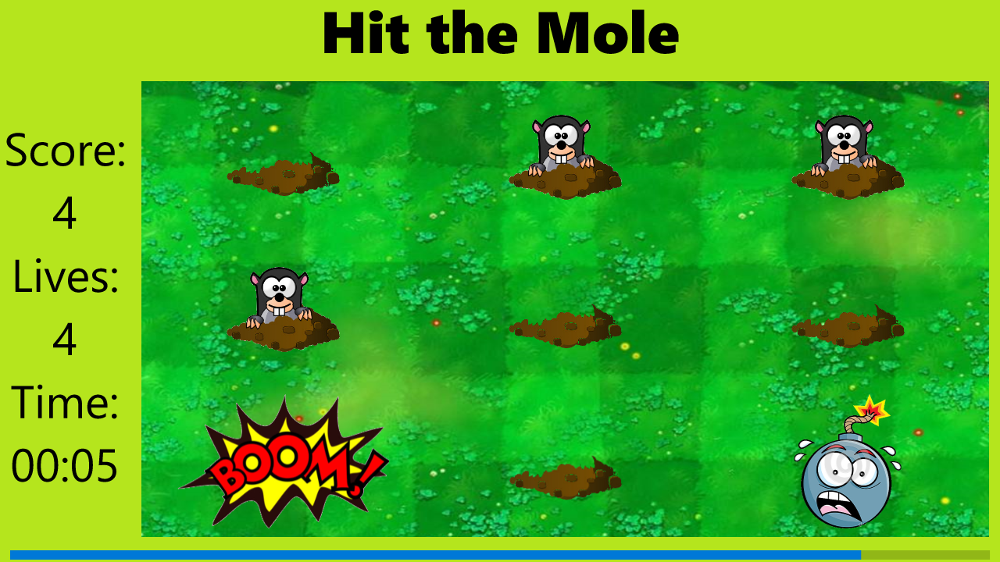
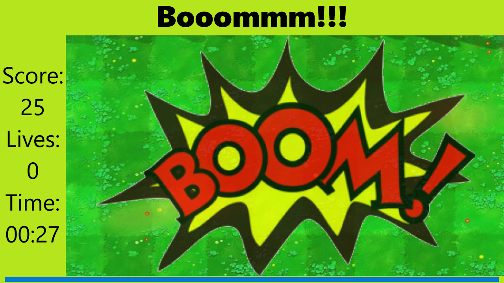

# Hit the Mole

**Hit the Mole** is a Universal Windows Game, built in *BUPT 01 Cafe*.

## Motivation

We decided to build a hit-the-mole game for a Programming Course and
found that UWP was a nice choice. :)

Learning to build C#/.NET apps instead of MFC apps. 

## Features

- Responsive Design
- MVVM Architecture

## Screenshots

## 3rd Party

The *Mole*, *Bomb*, *Boom*, *Grassland* images are from the Internet.
## Thanks for @BOT-Man-JL 's help !##
